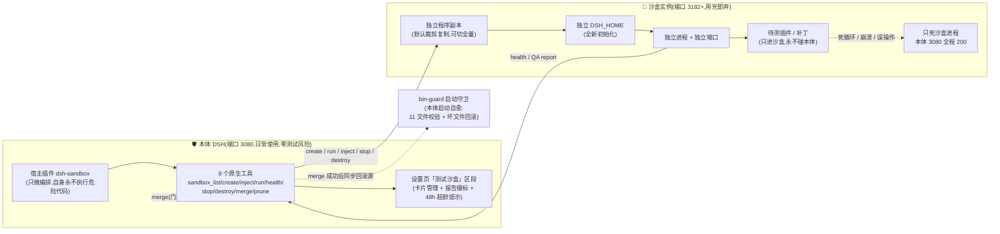
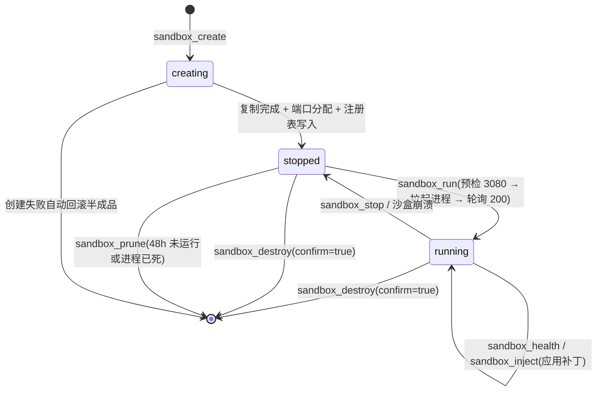
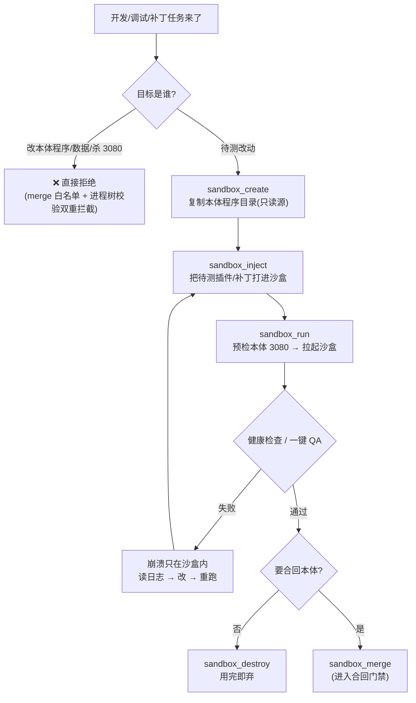
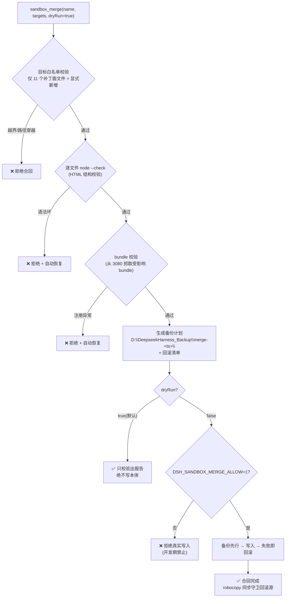
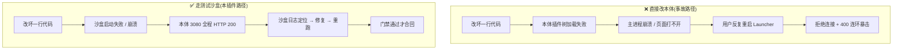
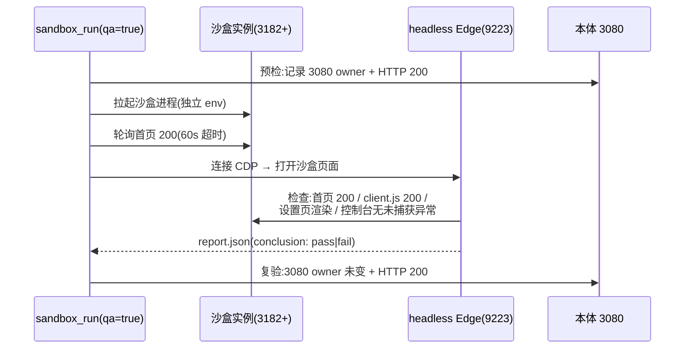
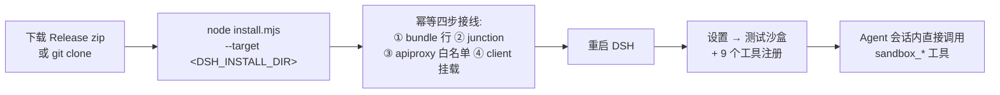

# dsh-sandbox 工作流程图

> 本文件用 Mermaid 绘制,在 GitHub / VS Code / 支持 Mermaid 的阅读器中可直接渲染。

## 1. 总体架构:本体与沙盒的进程级隔离

## 2. 沙盒生命周期状态机

## 3. 开发任务自动路由(政策 6 的机器执行形态)

## 4. 合回门禁(sandbox_merge,机器强制,不可绕过)

## 5. 两路对照:为什么必须走沙盒

## 6. 一键 QA 时序(CDP 9223 驱动真实浏览器)

## 7. 发布与安装流程(最终用户视角)

